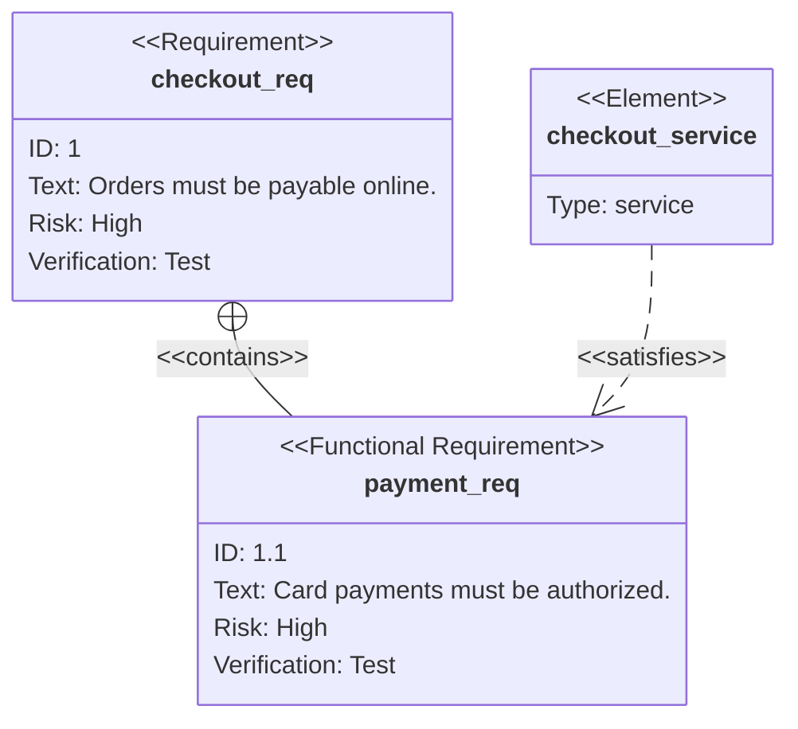
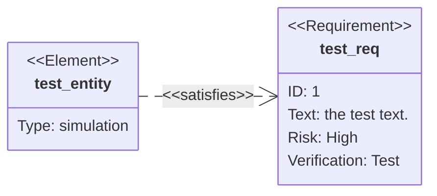

# Requirement 示例

以下来自 Pele 官方 Examples 首页的精选示例。完整语法与边界情况见 <https://pele.run/examples/requirement>。

```mermaid
---
config:
  theme: default
  look: classic
  layout: dagre
---
requirementDiagram
  requirement checkout_req {
    id: 1
    text: Orders must be payable online.
    risk: high
    verifymethod: test
  }
  functionalRequirement payment_req {
    id: 1.1
    text: Card payments must be authorized.
    risk: high
    verifymethod: test
  }
  element checkout_service {
    type: service
  }
  checkout_req - contains -> payment_req
  checkout_service - satisfies -> payment_req
```

```mermaid
requirementDiagram

direction LR

requirement test_req {
    id: 1
    text: the test text.
    risk: high
    verifymethod: test
}

element test_entity {
    type: simulation
}

test_entity - satisfies -> test_req
```
